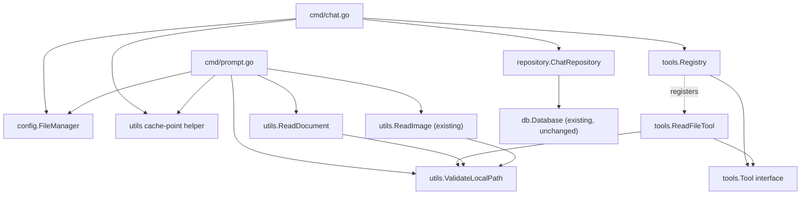

# Component Dependency

## Dependency Matrix

| Component | Depends On | Depended On By |
|---|---|---|
| `cmd/chat.go` (`chatCmd.Run`) | `config.FileManager`, `tools.Registry`, `tools.ReadFileTool`, `utils` (cache-point helper), `repository.ChatRepository`, AWS SDK Bedrock types | (entry point — nothing depends on it) |
| `cmd/prompt.go` (`promptCmd.Run`) | `config.FileManager`, `utils` (cache-point helper, `ValidateLocalPath`, `ReadDocument`, existing `ReadImage`), AWS SDK Bedrock types | (entry point — nothing depends on it) |
| `tools.Registry` | `tools.Tool` interface, AWS SDK Bedrock types (`ToolConfig`, `ToolUseBlock`, `ToolResultBlock`) | `cmd/chat.go` |
| `tools.ReadFileTool` | `tools.Tool` interface, `utils.ValidateLocalPath` | `tools.Registry` (registered into it) |
| `utils.ValidateLocalPath` | standard library (`os`, `path/filepath`) | `tools.ReadFileTool`, `utils.ReadDocument`, `utils.ReadImage` (refactored to reuse it) |
| `utils.ReadDocument` (new) | `utils.ValidateLocalPath` | `cmd/prompt.go` |
| `utils` cache-point helper (new) | AWS SDK Bedrock types | `cmd/chat.go`, `cmd/prompt.go` |
| `config.FileManager` | Viper (existing) | `cmd/chat.go`, `cmd/prompt.go` (existing + new `system-prompt` key) |
| `repository.ChatRepository` | `db.Database` (existing) | `cmd/chat.go` (existing, unchanged interface) |

No changes to: `db`, `db/sqlite`, `factory` — none of the 5 features touch persistence connection/migration logic.

## Dependency Diagram



### Text Alternative
```
cmd/chat.go -> config.FileManager, tools.Registry, utils cache-point helper, repository.ChatRepository
cmd/prompt.go -> config.FileManager, utils cache-point helper, utils.ValidateLocalPath,
                 utils.ReadDocument, utils.ReadImage (existing)
tools.Registry -> tools.Tool interface; registers tools.ReadFileTool
tools.ReadFileTool -> tools.Tool interface, utils.ValidateLocalPath
utils.ReadDocument -> utils.ValidateLocalPath
utils.ReadImage (refactored) -> utils.ValidateLocalPath
repository.ChatRepository -> db.Database (unchanged)
```

## Communication Patterns
- All calls are synchronous, in-process Go function calls — no new IPC, no new network boundaries, no new goroutine coordination beyond what `ProcessStreamingOutput` already does for streaming.
- `tools.Registry.Dispatch` returns a Bedrock content block value (not an error propagated up the call stack) by design — tool failures are conversation-level events the model should see and can respond to (FR2.3), not CLI-level fatal errors.
