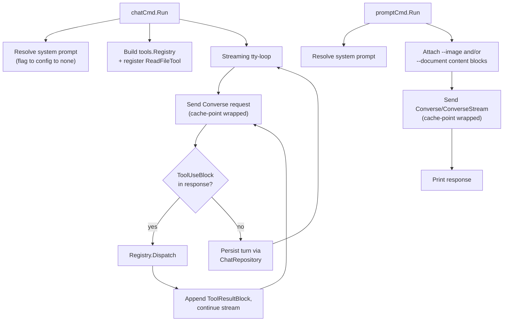
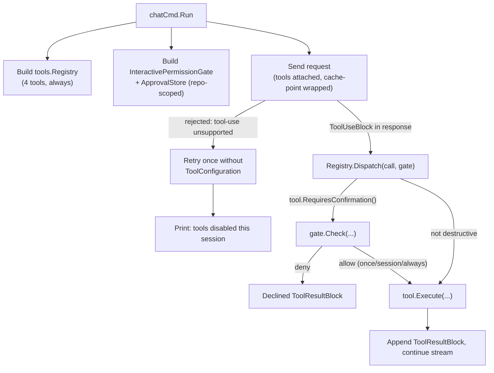

# Services

chat-cli is a single-process CLI, not a multi-service backend — there is no separate service layer to introduce. "Services" here means the existing request-orchestration entry points (`chat` and `prompt` commands' `Run` functions), documented as they're extended by #81-#85.

## Service: `chatCmd.Run` (`cmd/chat.go`, existing, extended)
- **Responsibilities today**: Load config, open DB, resolve/validate model, replay prior messages, run the streaming input/output loop, persist each turn.
- **New orchestration added**:
  - Resolve system prompt (flag → config → none) and attach `SystemContentBlocks` if present (FR1).
  - Build a `tools.Registry`, register `ReadFileTool`, call `registry.ToolConfig()` and attach to the request if non-nil (FR2.1).
  - On receiving `ContentBlockMemberToolUse` in the stream, call `registry.Dispatch(...)` and append the resulting `ToolResultBlock`, continuing the stream before returning control to the user (FR2.2-FR2.3).
  - Wrap the outgoing request with the cache-point helper when a system prompt is present (FR3.1, FR3.3).
  - Attach `AdditionalModelRequestFields` when `--thinking` is set; render any reasoning content block distinctly (FR5.1-FR5.2).
- **Orchestration pattern**: Sequential, single-threaded — matches the existing `for { ... }` tty-loop structure; tool dispatch happens synchronously within a turn before the next user prompt is read.

## Service: `promptCmd.Run` (`cmd/prompt.go`, existing, extended)
- **Responsibilities today**: Load config, build a one-shot request (with optional image, optional stdin document), call `Converse`/`ConverseStream`, print the response.
- **New orchestration added**:
  - Same system-prompt resolution as `chat` (FR1).
  - New `--document` flag path: validate via `utils.ValidateLocalPath`/`utils.ReadDocument`, attach as `ContentBlockMemberDocument`, independent of and alongside the existing `--image` path (FR4.1-FR4.4).
  - Cache-point wrapping when a system prompt or piped document is present (FR3.1-FR3.3).
  - `--thinking` support, same as `chat` (FR5).
  - **No tool-use orchestration** — Story 2.1/2.2 scope this to `chat` only (single-shot `prompt` doesn't have a natural place for multi-turn tool round trips in this pass).

## Orchestration Diagram



### Text Alternative
```
chatCmd.Run:
  resolve system prompt -> build tool registry (register ReadFileTool)
  -> loop: send request (cache-point wrapped)
     -> if ToolUseBlock in response: dispatch via registry, append ToolResultBlock, resend
     -> else: persist turn, read next user input, repeat

promptCmd.Run:
  resolve system prompt -> attach --image and/or --document content blocks
  -> send request (cache-point wrapped) -> print response
  (no tool-use orchestration in prompt)
```

---

# Initiative 3 Service Changes (#86)

## Service: `chatCmd.Run` (`cmd/chat.go`, extended again)

- **Orchestration changes**:
  - `--tools` flag removed; the registry is always built (now with 4 tools: `read_file`, `write_file`, `run_shell`, `git_diff`) and `ToolConfiguration()` is always attached (FR1.1, FR1.4).
  - An `InteractivePermissionGate` (backed by an `ApprovalStore` scoped to the current repo root via `utils.FindGitBoundary`) is constructed once per session and passed into every `Registry.Dispatch` call (FR5-FR7).
  - The Converse/ConverseStream call is wrapped with a new retry-without-`ToolConfiguration`-on-rejection policy, structurally identical to `cmd/promptcache.go`'s existing cache-point retry wrapper (FR1.2) — on success after retry, prints the FR1.3 notice.
- **Orchestration pattern unchanged**: still the same sequential, single-threaded tty-loop; the permission check happens synchronously inside `Dispatch`, blocking the loop exactly the way a tool's `Execute` already blocks it today — no new concurrency.

## Orchestration Diagram (Initiative 3 addition)



### Text Alternative
```
chatCmd.Run (Initiative 3):
  build tools.Registry (4 tools, always) -> build InteractivePermissionGate (repo-scoped ApprovalStore)
  -> send request (tools attached)
     -> if rejected for unsupported tool use: retry once without ToolConfiguration, notify user
     -> if ToolUseBlock in response: Dispatch(call, gate)
        -> if tool.RequiresConfirmation(): gate.Check(...) -> deny: declined result | allow: Execute
        -> if not destructive: Execute directly
        -> append ToolResultBlock, continue stream
```
