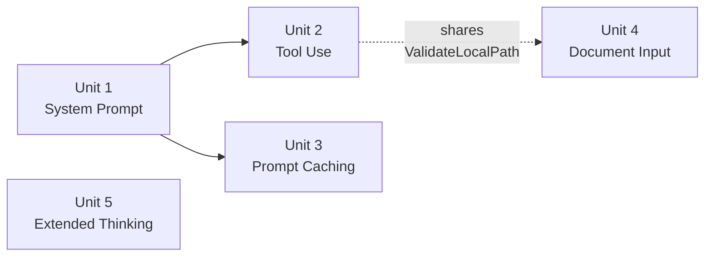

# Unit of Work Dependency

All "dependencies" below are **soft sequencing recommendations**, not hard technical blockers — this is solo, sequential AI-DLC execution (one unit fully completed, including tests, before the next begins per `core-workflow.md`'s Per-Unit Loop), not parallel team coordination.

## Dependency Matrix

| Unit | Depends On | Reason | Hard or Soft |
|---|---|---|---|
| Unit 1 — System Prompt | None | Foundational | — |
| Unit 2 — Tool Use | Unit 1 (recommended) | A system prompt is the natural place to instruct the model about available tools | Soft |
| Unit 3 — Prompt Caching | Unit 1 (recommended) | Needs a system prompt to exist to exercise the "cache after system prompt" acceptance criterion (FR3.1) | Soft |
| Unit 4 — Document Input | Unit 2 (only for shared code) | If Unit 2 lands first, Unit 4 reuses `utils.ValidateLocalPath` instead of introducing it | Soft (whichever of Unit 2/4 lands first introduces the shared helper) |
| Unit 5 — Extended Thinking | None | Fully independent | — |

## Recommended Build Order



### Text Alternative
```
Unit 1 (System Prompt) -> Unit 2 (Tool Use) -> Unit 3 (Prompt Caching) -> Unit 4 (Document Input) -> Unit 5 (Extended Thinking)
Unit 5 has no dependencies and could run anywhere in the sequence; placed last as the smallest, most independent unit.
```

This is the same 1-2-3-4-5 order already recommended in `requirements.md` and `execution-plan.md` — Units Generation confirms it rather than changing it.

## Coordination Points
- **Shared code**: `utils.ValidateLocalPath` (introduced by Unit 2 or Unit 4, whichever lands first) and the cache-point helper (Unit 3) are the only cross-unit shared artifacts. Both are additive utility functions — no unit needs to modify another unit's code to integrate with them, only call them.
- **No shared mutable state**: Each unit's flags/config keys are independent; a user can combine `--system`, `--thinking`, `--document`, and tool-use in a single `chat` invocation without the units having coordinated on request-building order beyond "system prompt block, then content blocks, then tool config" (standard Converse request shape).
