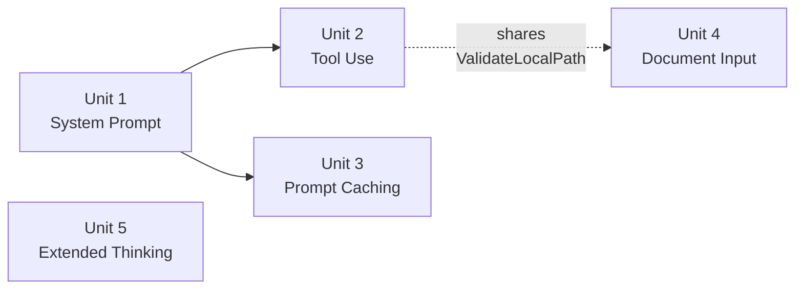

# Unit of Work Dependency

All "dependencies" below are **soft sequencing recommendations**, not hard technical blockers — this is solo, sequential AI-DLC execution (one unit fully completed, including tests, before the next begins per `core-workflow.md`'s Per-Unit Loop), not parallel team coordination.

## Dependency Matrix

| Unit | Depends On | Reason | Hard or Soft |
|---|---|---|---|
| Unit 1 — System Prompt | None | Foundational | — |
| Unit 2 — Tool Use | Unit 1 (recommended) | A system prompt is the natural place to instruct the model about available tools | Soft |
| Unit 3 — Prompt Caching | Unit 1 (recommended) | Needs a system prompt to exist to exercise the "cache after system prompt" acceptance criterion (FR3.1) | Soft |
| Unit 4 — Document Input | Unit 2 (only for shared code) | If Unit 2 lands first, Unit 4 reuses `utils.ValidateLocalPath` instead of introducing it | Soft (whichever of Unit 2/4 lands first introduces the shared helper) |
| Unit 5 — Extended Thinking | None | Fully independent | — |

## Recommended Build Order



### Text Alternative
```
Unit 1 (System Prompt) -> Unit 2 (Tool Use) -> Unit 3 (Prompt Caching) -> Unit 4 (Document Input) -> Unit 5 (Extended Thinking)
Unit 5 has no dependencies and could run anywhere in the sequence; placed last as the smallest, most independent unit.
```

This is the same 1-2-3-4-5 order already recommended in `requirements.md` and `execution-plan.md` — Units Generation confirms it rather than changing it.

## Coordination Points
- **Shared code**: `utils.ValidateLocalPath` (introduced by Unit 2 or Unit 4, whichever lands first) and the cache-point helper (Unit 3) are the only cross-unit shared artifacts. Both are additive utility functions — no unit needs to modify another unit's code to integrate with them, only call them.
- **No shared mutable state**: Each unit's flags/config keys are independent; a user can combine `--system`, `--thinking`, `--document`, and tool-use in a single `chat` invocation without the units having coordinated on request-building order beyond "system prompt block, then content blocks, then tool config" (standard Converse request shape).

---

# Initiative 3 Dependencies (#86)

Unlike Initiative 1's units (mostly independent), Unit 7 has a **hard** dependency here — it needs Unit 6's extended `Tool` interface and `PermissionGate` to compile against, not just a "nicer if it exists first" recommendation.

## Dependency Matrix

| Unit | Depends On | Reason | Hard or Soft |
|---|---|---|---|
| Unit 6 — Confirmation and Sticky Approval Engine | None | Foundational - defines the extended `Tool` interface and `PermissionGate` everything else builds on | — |
| Unit 7 — New Built-in Tools | Unit 6 | `WriteFileTool`/`RunShellTool` must implement `RequiresConfirmation()`/`ConfirmationSummary()` from the extended interface, and `Registry.Dispatch` (extended in Unit 6) must exist to gate them | **Hard** |
| Unit 8 — Automatic Tool-Use Enablement | Unit 6 + Unit 7 (recommended) | `chat.go`'s "always build the full registry + gate" wiring is most coherent to write once the full tool set and gate exist, though the retry-without-tools logic itself doesn't technically require them | Soft |

## Recommended Build Order


### Text Alternative
```
Unit 6 (Confirmation Engine) -> Unit 7 (New Tools) -> Unit 8 (Automatic Enablement)
```

## Coordination Points
- **Shared code**: `utils.FindGitBoundary` (extracted in Unit 6) is used by Unit 6's own `ApprovalStore` and, separately, refactored into `cmd/projectcontext.go` (#88) - a one-time extraction, not an ongoing coordination point.
- **The only hard dependency in this entire session's work so far**: Unit 7 literally cannot compile until Unit 6's interface extension lands - this must be enforced in build order, not just recommended.
