# Execution Plan: Universal Project-Context File Convention (#88)

## Detailed Analysis Summary

### Transformation Scope (Brownfield)
- **Transformation Type**: Single component change - new file-discovery/loading logic feeding into the existing system-prompt pipeline built in Initiative 1 (#81)
- **Primary Changes**: New discovery logic (precedence list, directory walk-up to `.git` boundary, size-guarded read), a new `context-files` config key, a `--no-context-file` flag, and a one-line startup notice in `chat`
- **Related Components**: `cmd/systemprompt.go` (reused as-is - the loaded content flows into the existing `buildSystemContentBlocks`), `cmd/chat.go` (new call site at startup, before the existing system-prompt resolution short-circuits), `cmd/config.go` (`supportedConfigKeys` gains `context-files`), `cmd/promptcache.go` (reused as-is - no changes needed, caching already applies to whatever ends up in the system prompt)

### Change Impact Assessment
- **User-facing changes**: Yes - `chat` sessions in a repo containing an `AGENTS.md`/`CLAUDE.md`/`.github/copilot-instructions.md` will now get a system prompt automatically where none existed before. This is the one meaningfully new behavior (everything else in Initiative 1 was purely opt-in via a flag); mitigated by the startup notice (FR6) and the disable flag (FR5).
- **Structural changes**: No - no new package, no new subsystem shape; this is a new pure-function file plus one new call site, following the exact precedent of `cmd/systemprompt.go`/`cmd/promptcache.go`/`cmd/documentinput.go`/`cmd/reasoning.go` from Initiative 1.
- **Data model changes**: No - no schema, no persistence changes.
- **API changes**: No - no new Bedrock API surface. Reuses `SystemContentBlocks` and cache-point plumbing already built and tested in Initiative 1.
- **NFR impact**: Yes - security (bounded, read-only directory walk-up; must not escape upward past the repo root or read unintended files) and reliability (missing/unreadable files must degrade to "no match", never a fatal error).

### Component Relationships (Brownfield)
- **Primary Component**: New `cmd/projectcontext.go` (name to be finalized in Functional Design)
- **Consuming Component**: `cmd/chat.go` - the only call site, per the chat-only scope decision
- **Shared Components Reused As-Is**: `cmd/systemprompt.go` (`buildSystemContentBlocks`), `cmd/promptcache.go` (`withSystemCachePoint`), `cmd/config.go` (`supportedConfigKeys` pattern)
- **Dependent Components**: None - nothing else in the codebase calls into this new logic
- **Supporting Components**: None (no infra, no CI changes needed beyond the existing `ci.yml` already running `make test`/`make lint`/integration tests on every PR)

### Risk Assessment
- **Risk Level**: Low - isolated to one new file plus one new call site in an already-well-tested command; trivially reversible (revert the commit, or use the new disable flag); no infrastructure, no data model, no external API surface changes
- **Rollback Complexity**: Easy
- **Testing Complexity**: Simple - pure functions (precedence matching, walk-up-to-`.git`, truncation) are directly unit-testable with a temp-directory fixture, no SDK mocking needed at all (unlike Initiative 1's tool-use/streaming work)

## Workflow Visualization

```mermaid
flowchart TD
    Start(["User Request: AGENTS.md convention"])

    subgraph INCEPTION["🔵 INCEPTION PHASE"]
        WD["Workspace Detection<br/><b>COMPLETED</b>"]
        RA["Requirements Analysis<br/><b>COMPLETED</b>"]
        US["User Stories<br/><b>SKIP</b>"]
        WP["Workflow Planning<br/><b>COMPLETED</b>"]
        AD["Application Design<br/><b>SKIP</b>"]
        UG["Units Generation<br/><b>SKIP</b>"]
    end

    subgraph CONSTRUCTION["🟢 CONSTRUCTION PHASE"]
        FD["Functional Design + NFR<br/>(combined)<br/><b>EXECUTE</b>"]
        ID["Infrastructure Design<br/><b>SKIP</b>"]
        CG["Code Generation<br/><b>EXECUTE</b>"]
        BT["Build and Test<br/><b>EXECUTE</b>"]
    end

    subgraph OPERATIONS["🟡 OPERATIONS PHASE"]
        OPS["Operations<br/><b>PLACEHOLDER</b>"]
    end

    Start --> WD --> RA --> US --> WP --> AD --> UG --> FD --> ID --> CG --> BT --> OPS --> End(["Complete"])

    style WD fill:#4CAF50,stroke:#1B5E20,stroke-width:3px,color:#fff
    style RA fill:#4CAF50,stroke:#1B5E20,stroke-width:3px,color:#fff
    style WP fill:#4CAF50,stroke:#1B5E20,stroke-width:3px,color:#fff
    style US fill:#BDBDBD,stroke:#424242,stroke-width:2px,stroke-dasharray: 5 5,color:#000
    style AD fill:#BDBDBD,stroke:#424242,stroke-width:2px,stroke-dasharray: 5 5,color:#000
    style UG fill:#BDBDBD,stroke:#424242,stroke-width:2px,stroke-dasharray: 5 5,color:#000
    style FD fill:#FFA726,stroke:#E65100,stroke-width:3px,stroke-dasharray: 5 5,color:#000
    style ID fill:#BDBDBD,stroke:#424242,stroke-width:2px,stroke-dasharray: 5 5,color:#000
    style CG fill:#4CAF50,stroke:#1B5E20,stroke-width:3px,color:#fff
    style BT fill:#4CAF50,stroke:#1B5E20,stroke-width:3px,color:#fff
    style OPS fill:#FFF59D,stroke:#F9A825,stroke-width:2px,color:#000
    style Start fill:#CE93D8,stroke:#6A1B9A,stroke-width:3px,color:#000
    style End fill:#CE93D8,stroke:#6A1B9A,stroke-width:3px,color:#000

    linkStyle default stroke:#333,stroke-width:2px
```

## Phases to Execute

### 🔵 INCEPTION PHASE
- [x] Workspace Detection (COMPLETED)
- [x] Requirements Analysis (COMPLETED)
- [ ] User Stories - **SKIP**
  - **Rationale**: Single cohesive feature, one persona already established in Initiative 1, requirements already concrete at the FR level (FR1-FR6) with no acceptance-criteria ambiguity that stories would resolve.
- [x] Workflow Planning (this document)
- [ ] Application Design - **SKIP**
  - **Rationale**: No new component/subsystem shape - this is a pure-function addition following the exact established pattern of `cmd/systemprompt.go`/`cmd/promptcache.go`/`cmd/documentinput.go`, all of which also skipped Application Design in Initiative 1. No new services, no component-method contracts to define beyond what Functional Design will pin down directly.
- [ ] Units Generation - **SKIP**
  - **Rationale**: Naturally one unit of work; no parallelization benefit; straightforward implementation (file precedence matching + directory walk-up + config key), same category as Initiative 1's Unit 1 (System Prompt).

### 🟢 CONSTRUCTION PHASE
- [ ] Functional Design + NFR Requirements/Design - **EXECUTE (combined)**
  - **Rationale**: While there's no new Bedrock SDK surface to verify (unlike most of Initiative 1), there is real algorithmic design to pin down before writing tests: the exact walk-up-to-`.git` traversal, precedence-matching order, truncation behavior, and the interaction between `--no-context-file`/config/`--system` precedence. Combined with NFR since the only applicable NFR category is Security (bounded directory walk) plus Reliability (graceful degradation on missing/unreadable files) - same combined-presentation pattern used for Units 2 and 4 in Initiative 1.
  - Infrastructure Design sub-step - **SKIP**: No infrastructure in this project (decided globally in Initiative 1, still holds).
- [ ] Code Generation - **EXECUTE (ALWAYS)**
- [ ] Build and Test - **EXECUTE (ALWAYS)**

### 🟡 OPERATIONS PHASE
- [ ] Operations - **PLACEHOLDER** (no deployment/monitoring workflow exists or is planned for this project)

## Estimated Timeline
- **Total Stages Executing**: 3 (Functional Design+NFR, Code Generation, Build and Test) out of 7 possible Inception/Construction stages
- **Estimated Duration**: Single session, comparable to Initiative 1's Unit 1 or Unit 4 in scope

## Success Criteria
- **Primary Goal**: `chat` automatically picks up project context from `AGENTS.md`/`CLAUDE.md`/`.github/copilot-instructions.md` without breaking any existing behavior
- **Key Deliverables**: New discovery/loading logic, `context-files` config key, `--no-context-file` flag, startup notice, full test coverage, updated docs
- **Quality Gates**: `make test`, `make lint`, `make test-coverage` (no regression), `go test -tags=integration -v .` all passing
- **Integration Testing**: A cross-feature smoke test confirming the loaded content still gets a cache point (#83) and that an explicit `--system` correctly suppresses discovery (FR2)
