# Execution Plan: Built-in Agent Tools (#86)

## Detailed Analysis Summary

### Transformation Scope (Brownfield)
- **Transformation Type**: Multi-component addition - extends the existing `tools/` subsystem (Initiative 1 Unit 2: `Tool` interface, `Registry`, `Dispatch`) with 3 new tools, and introduces a genuinely new subsystem (a confirmation/permission engine) that nothing in the codebase resembles today.
- **Primary Changes**: `cmd/chat.go`'s tool-enablement wiring (remove `--tools` flag, always build `ToolConfiguration`, add retry-without-tools-on-rejection mirroring #83); 3 new `tools.Tool` implementations (`write_file`, `run_shell`, `git_diff`); a new permission-engine component (interactive confirmation prompt, pattern matching for `run_shell`/`write_file`, session-scoped in-memory store, per-repository persisted store).
- **Related Components**: `tools/` package (new tool implementations + the permission engine, likely its own file or sub-package), `cmd/chat.go` (wiring + retry logic), `cmd/root.go` (`--tools` flag removed), `utils.ValidateLocalPath` (reused by `write_file`), the `.git`-boundary-detection concept from #88 (reused for per-repo persisted-approval scoping).

### Change Impact Assessment
- **User-facing changes**: Yes, significant - `--tools` disappears entirely (tool use becomes unconditional), 3 new capabilities appear, and a new interactive confirmation prompt appears the first time a destructive tool is used in a session. This is the most user-visible change of any initiative so far.
- **Structural changes**: Yes - the permission engine is new architecture (component design, not just a pure-function file like Initiatives 1-2).
- **Data model changes**: Yes - a new persisted store for "always" approvals (scoped per git repository) is a new, structured piece of state distinct from the existing flat `config set` key-value system.
- **API changes**: No new Bedrock API surface - reuses the existing `ToolConfiguration`/`ToolResultBlock` plumbing from Unit 2 entirely as-is.
- **NFR impact**: Yes, substantial - Security is now a first-class concern (arbitrary shell execution, filesystem writes), not a light NFR pass like Initiative 2's.

### Component Relationships (Brownfield)
- **Primary Components**: New permission-engine logic (likely `tools/permission.go` or similar - exact package boundary decided in Application Design), 3 new `tools.Tool` implementations
- **Consuming Component**: `cmd/chat.go` - registers the new tools, calls the permission engine before dispatching destructive ones, implements the retry-without-tools fallback
- **Shared Components Reused As-Is**: `tools.Registry`/`Tool` interface/`Dispatch` (Unit 2), `utils.ValidateLocalPath` (Units 2/4), the `.git`-boundary-walk concept (Initiative 2, `cmd/projectcontext.go`'s `findGitBoundary`-equivalent logic)
- **Dependent Components**: `write_file`/`run_shell` depend on the permission engine existing before they can execute destructively; `git_diff` has no such dependency (read-only)
- **Supporting Components**: None (no infra in this project)

### Risk Assessment
- **Risk Level**: Medium-High - `run_shell` is arbitrary command execution and `write_file` is a destructive filesystem action; the confirmation gate is the primary control, so its correctness matters more than anything in Initiatives 1-2. Mitigated by: no static command allowlist needed (gate covers it), cwd-confinement reused from proven code, and denial/auto-disable paths made explicit as their own user stories.
- **Rollback Complexity**: Moderate - removing `--tools` is a behavior change existing scripts/muscle-memory may depend on (though the flag simply becomes a no-op/absent rather than breaking anything that doesn't reference it).
- **Testing Complexity**: Moderate-Complex - the permission engine's pattern-matching and storage logic is pure and directly unit-testable (similar to #88's `t.TempDir()` approach for the persisted store), but the interactive confirmation prompt itself needs either an injectable prompt function (mirroring how `runChatTurnWithTools`'s `converseStreamFunc` was made injectable in Unit 2) or a documented manual-verification gap, decided in Functional Design.

## Workflow Visualization

```mermaid
flowchart TD
    Start(["User Request: Built-in Agent Tools #86"])

    subgraph INCEPTION["🔵 INCEPTION PHASE"]
        WD["Workspace Detection<br/><b>COMPLETED</b>"]
        RA["Requirements Analysis<br/><b>COMPLETED</b>"]
        US["User Stories<br/><b>COMPLETED</b>"]
        WP["Workflow Planning<br/><b>COMPLETED</b>"]
        AD["Application Design<br/><b>EXECUTE</b>"]
        UG["Units Generation<br/><b>EXECUTE</b>"]
    end

    subgraph CONSTRUCTION["🟢 CONSTRUCTION PHASE"]
        FD["Per-Unit Functional Design + NFR<br/><b>EXECUTE</b>"]
        ID["Infrastructure Design<br/><b>SKIP</b>"]
        CG["Code Generation<br/><b>EXECUTE</b>"]
        BT["Build and Test<br/><b>EXECUTE</b>"]
    end

    subgraph OPERATIONS["🟡 OPERATIONS PHASE"]
        OPS["Operations<br/><b>PLACEHOLDER</b>"]
    end

    Start --> WD --> RA --> US --> WP --> AD --> UG --> FD --> ID --> CG --> BT --> OPS --> End(["Complete"])

    style WD fill:#4CAF50,stroke:#1B5E20,stroke-width:3px,color:#fff
    style RA fill:#4CAF50,stroke:#1B5E20,stroke-width:3px,color:#fff
    style US fill:#4CAF50,stroke:#1B5E20,stroke-width:3px,color:#fff
    style WP fill:#4CAF50,stroke:#1B5E20,stroke-width:3px,color:#fff
    style AD fill:#FFA726,stroke:#E65100,stroke-width:3px,stroke-dasharray: 5 5,color:#000
    style UG fill:#FFA726,stroke:#E65100,stroke-width:3px,stroke-dasharray: 5 5,color:#000
    style FD fill:#FFA726,stroke:#E65100,stroke-width:3px,stroke-dasharray: 5 5,color:#000
    style ID fill:#BDBDBD,stroke:#424242,stroke-width:2px,stroke-dasharray: 5 5,color:#000
    style CG fill:#4CAF50,stroke:#1B5E20,stroke-width:3px,color:#fff
    style BT fill:#4CAF50,stroke:#1B5E20,stroke-width:3px,color:#fff
    style OPS fill:#FFF59D,stroke:#F9A825,stroke-width:2px,color:#000
    style Start fill:#CE93D8,stroke:#6A1B9A,stroke-width:3px,color:#000
    style End fill:#CE93D8,stroke:#6A1B9A,stroke-width:3px,color:#000

    linkStyle default stroke:#333,stroke-width:2px
```

## Phases to Execute

### 🔵 INCEPTION PHASE
- [x] Workspace Detection, Requirements Analysis, User Stories, Workflow Planning (this document) - COMPLETED
- [ ] Application Design - **EXECUTE**
  - **Rationale**: The permission engine is genuinely new architecture (component boundaries, storage shape, how tools call into the gate) - unlike Initiatives 1-2, this isn't just a pure-function file following an established pattern. Needs explicit component/interface design before splitting into units.
- [ ] Units Generation - **EXECUTE**
  - **Rationale**: Multiple packages affected, new persisted state, complex pattern-matching logic, and natural seams between (a) automatic-enablement wiring, (b) the permission engine itself, and (c) the 3 new tools that consume it - matches Units Generation's "new data models/complex algorithms/multiple packages" execute criteria, unlike Initiative 2's single natural unit.

### 🟢 CONSTRUCTION PHASE
- [ ] Per-Unit Functional Design + NFR - **EXECUTE** (per unit, finalized after Units Generation)
  - **Rationale**: Security is now a first-class NFR category (arbitrary command execution, destructive writes) - every unit touching the permission engine or the destructive tools needs explicit NFR treatment, not a skip.
  - Infrastructure Design sub-step - **SKIP**: No infrastructure in this project (unchanged from Initiatives 1-2).
- [ ] Code Generation - **EXECUTE (ALWAYS)**
- [ ] Build and Test - **EXECUTE (ALWAYS)**

### 🟡 OPERATIONS PHASE
- [ ] Operations - **PLACEHOLDER** (unchanged)

## Estimated Timeline
- **Total Stages Executing**: 6 of 7 possible Inception/Construction stages (only Infrastructure Design skipped) - the most complete treatment of any initiative so far, proportional to the risk profile.
- **Estimated Duration**: Comparable to Initiative 1's Unit 2 (Tool Use) in complexity, likely the largest single initiative to date given the new permission-engine subsystem.

## Success Criteria
- **Primary Goal**: `chat` gains 3 new tools and automatic tool-use enablement, with a confirmation/sticky-approval system that makes destructive actions safe by construction, not by convention.
- **Key Deliverables**: New tools, permission engine (pattern matching, session store, per-repo persisted store, confirmation prompt), removal of `--tools`, retry-without-tools graceful degradation, full test coverage, updated docs.
- **Quality Gates**: `make test`, `make lint`, `make test-coverage` (no regression), `go test -tags=integration -v .` all passing; the denial and auto-disable-on-rejection paths specifically exercised, not just the happy path.
- **Integration Testing**: Cross-unit composition scenario confirming a destructive tool call actually blocks on the confirmation gate before executing, and that a granted "always" approval in one repo doesn't leak into another.
