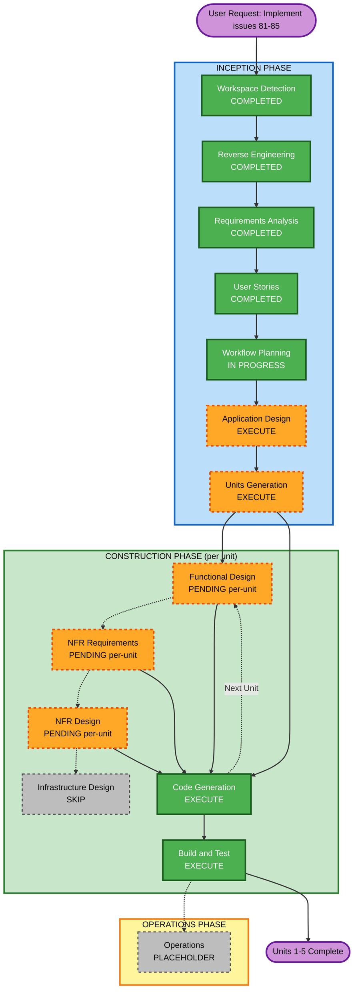

# Execution Plan

## Detailed Analysis Summary

### Transformation Scope (Brownfield)
- **Transformation Type**: Single-component change (application-layer only) — no architectural transformation, no deployment-model change, no new infrastructure. Everything lands inside the existing `cmd`/`utils`/`config` layers, likely plus one new small package for the tool registry.
- **Primary Changes**: Five additive capabilities to `chat`/`prompt`: system prompt, tool use, prompt caching, document input, extended thinking (FR1-FR5, issues #81-#85).
- **Related Components**: `cmd/chat.go`, `cmd/prompt.go`, `config/config.go` (new `system-prompt` key), `utils/` (extended validation helpers), a new tool-registry component (for #82).

### Change Impact Assessment
- **User-facing changes**: Yes — 5 new opt-in flags/behaviors across `chat` and `prompt`. No existing flag/behavior changes (NFR1).
- **Structural changes**: Moderate — a new tool-registry/execution-loop component is genuinely new structure; the other 4 features extend existing request-building code without new components.
- **Data model changes**: No — the `chats` SQLite table is unchanged. Tool-call turns are persisted using the existing `Persona` values ("User"/"Assistant") per Story 2.1's acceptance criteria; no migration needed.
- **API changes**: N/A (no network API) — CLI flag surface grows additively only.
- **NFR impact**: Yes — security (path-traversal-safe file access for both the `read_file` tool and document attachments, reusing `utils.ReadImage`'s pattern) and performance (prompt caching is explicitly a performance feature).

### Component Relationships (Brownfield)
```markdown
## Component Relationships
- **Primary Components**: cmd/chat.go, cmd/prompt.go
- **Shared Components**: utils/ (extended: document validation, streaming-loop changes for tool-use), config/ (new system-prompt config key), a new tool-registry component
- **Dependent Components**: repository.ChatRepository (used as-is, no interface changes needed)
- **Supporting Components**: None — no infrastructure, no CDK/Terraform, no deployment changes
```

| Component | Change Type | Reason | Priority |
|---|---|---|---|
| `cmd/chat.go` | Major | Tool-use loop, system prompt, caching, thinking flag all touch the conversation loop | Critical |
| `cmd/prompt.go` | Major | System prompt, document input, thinking flag all touch the one-shot request builder | Critical |
| `config/config.go` | Minor | One new persisted key (`system-prompt`), same pattern as `model-id` | Important |
| `utils/` | Minor-Major | New document-validation helper (generalizes `ReadImage`); possibly a new file for the tool registry | Important |
| `repository/`, `db/`, `factory/` | None | No schema or persistence-interface changes needed | N/A |

### Risk Assessment
- **Risk Level**: Medium — multiple components touched and one genuinely new subsystem (tool use), but every feature is additive/off-by-default, isolated by unit, and independently revertable; no data migration or infra risk.
- **Rollback Complexity**: Easy per-unit — each of the 5 features is a separate, independently mergeable change; reverting one doesn't affect the others (aside from Prompt Caching's soft dependency on System Prompt existing).
- **Testing Complexity**: Moderate — tool use needs a mocked tool registry and simulated `ToolUseBlock`/`ToolResultBlock` round trips; the other 4 are testable with request-shape assertions similar to existing tests.

## Workflow Visualization



### Text Alternative
```
INCEPTION: Workspace Detection (DONE) -> Reverse Engineering (DONE) ->
  Requirements Analysis (DONE) -> User Stories (DONE) -> Workflow Planning (IN PROGRESS)
  -> Application Design (EXECUTE) -> Units Generation (EXECUTE)
CONSTRUCTION (runs once per unit, 5 units expected):
  Functional Design (per-unit, decided during Units Generation/Construction)
  -> NFR Requirements (per-unit) -> NFR Design (per-unit) -> Infrastructure Design (SKIP, no infra in this project)
  -> Code Generation (ALWAYS) -> loops back to Functional Design for next unit
  -> after all units: Build and Test (ALWAYS)
OPERATIONS: Placeholder, not entered this pass
```

## Phases to Execute

### INCEPTION PHASE
- [x] Workspace Detection (COMPLETED)
- [x] Reverse Engineering (COMPLETED)
- [x] Requirements Analysis (COMPLETED)
- [x] User Stories (COMPLETED)
- [x] Workflow Planning (this document)
- [ ] Application Design - **EXECUTE**
  - **Rationale**: Tool use (#82) introduces a genuinely new component (tool registry + execution-loop interface) that needs its methods and contracts defined before Units Generation can scope it accurately. The other 4 features extend existing request-building code and don't need separate component design.
- [ ] Units Generation - **EXECUTE**
  - **Rationale**: Multiple packages require changes (`cmd`, `utils`, `config`, possibly a new tool package) and one feature (tool use) has genuinely complex business logic — both are explicit triggers per `workflow-planning.md` Step 3.3. Five natural, mostly-independent units already exist from the epics in `stories.md`.

### CONSTRUCTION PHASE (decided per-unit during Construction, per `core-workflow.md`)
- [ ] Functional Design - **PENDING per-unit** — likely EXECUTE for the Tool Use unit (new business logic: tool dispatch, error-result contract); likely SKIP for System Prompt/Extended Thinking (simple flag plumbing); TBD for Prompt Caching/Document Input.
- [ ] NFR Requirements - **PENDING per-unit** — likely EXECUTE for Tool Use and Document Input units specifically because of the security requirement (path-traversal-safe file access, NFR3); likely SKIP for System Prompt/Extended Thinking.
- [ ] NFR Design - **PENDING per-unit** — follows from NFR Requirements per unit.
- [ ] Infrastructure Design - **SKIP**
  - **Rationale**: chat-cli has no infrastructure-as-code, no deployment-model change, no networking change. Confirmed globally, not deferred to per-unit.
- [ ] Code Generation - **EXECUTE (ALWAYS)**
  - **Rationale**: Implementation planning and code generation needed for every unit; TDD test-first per `CLAUDE.md`.
- [ ] Build and Test - **EXECUTE (ALWAYS)**
  - **Rationale**: `make test`, `make test-coverage`, `make lint`, and `make cli && go test -tags=integration -v` must all pass per `CLAUDE.md` before any unit is considered done.

### OPERATIONS PHASE
- [ ] Operations - PLACEHOLDER
  - **Rationale**: No deployment/monitoring workflow changes are in scope for this initiative.

## Recommended Unit Sequence (Brownfield, finalized during Units Generation)

Preliminary recommendation carried over from `requirements.md`'s summary, to be confirmed/refined during Units Generation:

1. **System Prompt (#81)** — foundational, lowest risk, soft-depended-on by Tool Use and Prompt Caching.
2. **Tool Use (#82)** — highest complexity; benefits from System Prompt existing (to instruct the model about tools).
3. **Prompt Caching (#83)** — depends on System Prompt (something to cache); independent of Tool Use.
4. **Document Input (#84)** — fully independent; can run in parallel with 2-3 if desired.
5. **Extended Thinking (#85)** — fully independent; natural last unit, smallest surface area.

## Estimated Timeline
- **Total Stages Remaining**: Application Design, Units Generation, then 5x (Construction per-unit loop), then Build and Test.
- **Estimated Duration**: Not time-boxed — this is agent-executed, session-paced work; sizing is by unit complexity, not calendar time. Tool Use (#82) is the largest unit; the other 4 are small-to-medium.

## Success Criteria
- **Primary Goal**: All 6 stories in `stories.md` implemented, with acceptance criteria met and existing backward compatibility (NFR1) preserved.
- **Key Deliverables**: Working `--system`, tool-use loop with `read_file`, automatic cache points with fallback, `--document` flag, `--thinking` flag; updated `README.md`/`docs/usage.md`.
- **Quality Gates**: `make test`, `make test-coverage` (no regression), `make lint`, `make cli && go test -tags=integration -v` all green per unit and at the end of Build and Test.
- **Integration Testing**: All 5 units working together in the same `chat`/`prompt` invocations without interference (e.g. `--system` + `--thinking` + tool use combined in one chat session).
