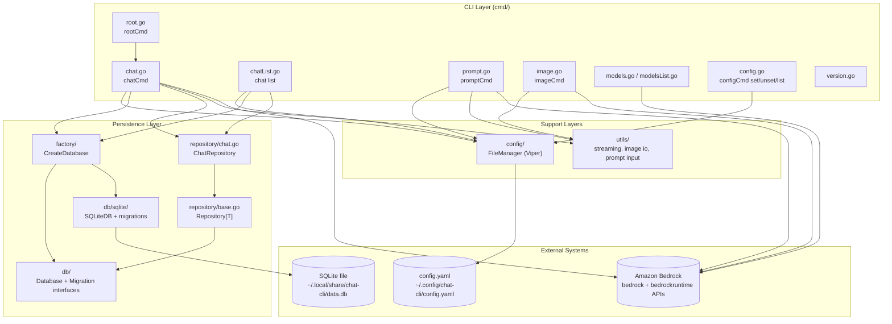
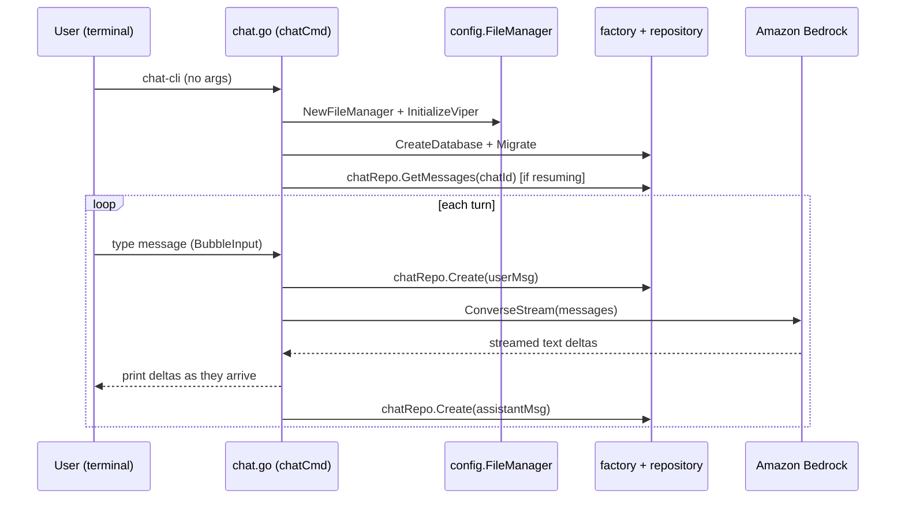

# System Architecture

## System Overview

Chat-CLI is a single-binary Go CLI application (no server, no separate backend). It follows a layered architecture: a Cobra-based CLI layer dispatches to AWS Bedrock directly and to a small local persistence layer. There is exactly one deployable artifact (`chat-cli`), distributed as pre-built binaries (GoReleaser), via Homebrew, or built from source with `make`.

## Architecture Diagram



### Text Alternative
```
CLI Layer (cmd/): root -> chat, chat list, prompt, image, models/models list,
config set/unset/list, version

chat, chat list, prompt, config all depend on config/FileManager (Viper)
chat, chat list depend on factory/CreateDatabase -> db/Database interface
  -> db/sqlite implementation -> repository/ChatRepository -> SQLite file
chat, prompt, image depend on utils/ (streaming output, image IO)
chat, prompt, image, models all call Amazon Bedrock (bedrock + bedrockruntime APIs)
```

## Component Descriptions

### cmd (CLI Layer)
- **Purpose**: Entry point for every user interaction; defines all Cobra commands/flags.
- **Responsibilities**: Argument/flag parsing, AWS Bedrock client construction and calls, orchestration of config + persistence layers, all user-facing output formatting.
- **Dependencies**: `config`, `db`, `repository`, `factory`, `utils`, AWS SDK v2 (`bedrock`, `bedrockruntime`), Cobra.
- **Type**: Application

### config
- **Purpose**: Resolve OS-specific config/data paths and manage a single Viper-backed YAML config file.
- **Responsibilities**: Path resolution (Windows/macOS/Linux/XDG), config file bootstrap, flag→config→default precedence helper (`GetConfigValue`).
- **Dependencies**: Viper, standard library `os`/`path/filepath`/`runtime`.
- **Type**: Application (shared library within the monolith)

### db
- **Purpose**: Define storage-agnostic contracts so the rest of the app never depends on a concrete database.
- **Responsibilities**: `Database` interface (`GetDB`, `Connect`, `Close`, `Migrate`), `Migration` interface, shared `Config` struct.
- **Dependencies**: `database/sql` only.
- **Type**: Application (abstraction layer)

### db/sqlite
- **Purpose**: Concrete SQLite implementation of the `db.Database`/`db.Migration` interfaces.
- **Responsibilities**: Open a `database/sql` connection via the pure-Go `modernc.org/sqlite` driver; create/upgrade the `chats` table and its `updated_at` trigger.
- **Dependencies**: `modernc.org/sqlite`, `db` package.
- **Type**: Application (persistence implementation)

### factory
- **Purpose**: Select the concrete `db.Database` implementation at runtime based on configured driver.
- **Responsibilities**: `CreateDatabase(config) (db.Database, error)` — currently only `"sqlite"` is wired up; a `"postgres"` branch is stubbed out in a comment for future use.
- **Dependencies**: `db`, `db/sqlite`.
- **Type**: Application (factory pattern)

### repository
- **Purpose**: Encapsulate SQL for chat persistence behind a generic repository interface.
- **Responsibilities**: `Repository[T]` generic interface (Create/GetByID/Update/Delete/List — only partially implemented for Chat); `ChatRepository` with `Create`, `List` (10 most recent, grouped by chat_id), `GetMessages` (full transcript for a chat_id).
- **Dependencies**: `db`.
- **Type**: Application (repository pattern)

### utils
- **Purpose**: Cross-cutting helpers not tied to any one command.
- **Responsibilities**: `ProcessStreamingOutput` (drains a Bedrock `ConverseStream` event channel into text + a `types.Message`), `ReadImage`/`DecodeImage` (image file IO + base64), `LoadDocument` (stdin piping), `StringPrompt`/`BubbleInput` (interactive terminal input widget built on `charmbracelet/bubbletea`).
- **Dependencies**: AWS SDK v2 bedrockruntime types, `charmbracelet/bubbles`, `charmbracelet/bubbletea`, `charmbracelet/lipgloss`, `golang.org/x/term`, `mattn/go-isatty`.
- **Type**: Application (shared utility library)

## Data Flow



### Text Alternative
```
1. User runs `chat-cli` (root delegates to chat command)
2. chat.go loads config (FileManager/Viper) and opens the SQLite DB (factory + Migrate)
3. If --chat-id is set, prior messages are loaded via ChatRepository.GetMessages and replayed
4. Loop: user types a message (BubbleInput) -> saved to DB -> sent to Bedrock ConverseStream
   -> streamed response printed live -> full response saved to DB -> repeat
5. "quit" or "/quit" or Ctrl+C exits the loop
```

## Integration Points

- **External APIs**:
  - Amazon Bedrock Control Plane (`bedrock.GetFoundationModel`, `bedrock.ListFoundationModels`) — model discovery and capability checks (text/image/streaming support).
  - Amazon Bedrock Runtime (`bedrockruntime.Converse`, `ConverseStream`, `InvokeModel`) — actual inference calls for chat, prompt, and image generation.
- **Databases**: Local SQLite file (`data.db` in the OS data directory) — sole persistence store, holds the `chats` table (all conversation history).
- **Third-party Services**: None beyond AWS (Bedrock). No telemetry, analytics, or other network calls found in the codebase.

## Infrastructure Components

- **CDK Stacks**: None — this is a client application, not infrastructure-as-code.
- **Deployment Model**: Distributed as cross-platform binaries via GoReleaser (`.goreleaser.yaml`) and a Homebrew tap (`chat-cli/chat-cli`); users run it locally against their own AWS credentials/region.
- **Networking**: No inbound networking. Outbound HTTPS calls only, to AWS Bedrock endpoints in the configured region (default `us-east-1`), authenticated via standard AWS SDK credential resolution (AWS CLI config/env/IAM role).
