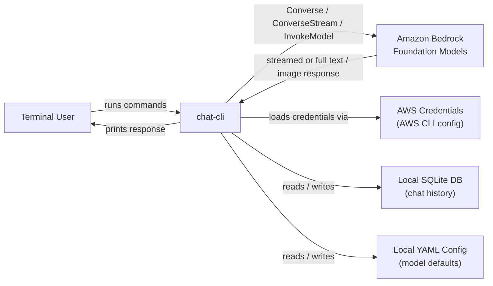

# Business Overview

## Business Context Diagram



### Text Alternative
```
Terminal User --runs commands--> chat-cli
chat-cli --Converse/ConverseStream/InvokeModel--> Amazon Bedrock
chat-cli --loads credentials--> AWS Credentials (AWS CLI config)
chat-cli --reads/writes--> Local SQLite DB (chat history)
chat-cli --reads/writes--> Local YAML Config (model defaults)
Amazon Bedrock --response--> chat-cli --prints--> Terminal User
```

## Business Description

- **Business Description**: Chat-CLI is a terminal-based client that gives developers a fast, scriptable way to talk to Amazon Bedrock foundation models (Anthropic Claude and others) without leaving the command line. It covers three core use cases: one-shot prompting (for scripting/piping), persistent interactive chat (for conversational work), and image generation (for models that support it). It intentionally has no server component — every invocation talks directly to Bedrock using the user's own AWS credentials, and all state (chat history, config defaults) is stored locally on the user's machine.

- **Business Transactions**:
  - **Send One-Shot Prompt** (`chat-cli prompt "<text>"`) — send a single message to a model and print the response (streamed or full), optionally with an attached image or piped-in document content.
  - **Start/Resume Interactive Chat** (`chat-cli` or `chat-cli --chat-id <id>`) — open a persistent, streaming conversation loop; every user/assistant turn is saved to SQLite and can be replayed by chat-id.
  - **List Recent Chats** (`chat-cli chat list`) — show the 10 most recent chat sessions (id, timestamp, first message) so the user can find a chat-id to resume.
  - **Generate Image** (`chat-cli image "<prompt>"`) — send a prompt to an image-generation model (Stability AI or Amazon Titan family) and write the resulting image to disk.
  - **List Available Models** (`chat-cli models list`) — query Bedrock for all foundation models available in the configured region.
  - **Manage Configuration** (`chat-cli config set|unset|list`) — persist default `model-id` / `custom-arn` values so they don't need to be passed as flags every time.
  - **Print Version** (`chat-cli version`) — report the installed CLI version and platform.

- **Business Dictionary**:
  - **Model ID**: Bedrock's identifier for a foundation model (e.g. `anthropic.claude-3-5-sonnet-20240620-v1:0`).
  - **Custom ARN**: An Amazon Resource Name pointing at a Bedrock Marketplace model or a cross-region inference profile; when set, it overrides `model-id`.
  - **Chat ID**: A UUID that groups a sequence of user/assistant messages into one conversation, used as the SQLite `chat_id` and as the Bedrock `RequestMetadata` correlation key.
  - **Persona**: Role label ("User" or "Assistant") stored per chat message row.
  - **Streaming**: Bedrock's `ConverseStream` API, which returns model output incrementally as it's generated (used by `chat` always, and by `prompt` unless `--no-stream` is passed).
  - **Document**: Content piped into `prompt`/`image` via stdin, auto-wrapped in `<document></document>` tags and appended to the prompt text (a convention Claude models respond well to).

## Component Level Business Descriptions

### cmd (CLI commands)
- **Purpose**: The user-facing surface of the product — parses flags/args and orchestrates AWS Bedrock calls, config loading, and database access for every business transaction listed above.
- **Responsibilities**: Command definitions (`root`, `chat`, `chat list`, `prompt`, `image`, `models`, `models list`, `config set/unset/list`, `version`); flag precedence resolution (flag → config → default); model capability validation (text/image/streaming) before calling Bedrock.

### config (Configuration Layer)
- **Purpose**: Give the CLI a persistent, OS-appropriate place to remember user preferences (default model, custom ARN, DB location) across invocations.
- **Responsibilities**: Resolve OS-specific config/data directories (XDG on Linux, `Library/Application Support` on macOS, `%APPDATA%` on Windows); initialize Viper; implement the flag → config → default precedence rule.

### db / repository / factory (Persistence Layer)
- **Purpose**: Durably store chat history so conversations can be resumed and browsed later.
- **Responsibilities**: Define a database-agnostic `Database` interface and `Repository[T]` pattern; provide a SQLite implementation with migrations; let a factory pick the concrete driver from config, keeping `cmd` code storage-agnostic.

### utils (Support Utilities)
- **Purpose**: Shared, storage/AWS-agnostic helpers used across commands.
- **Responsibilities**: Process Bedrock's `ConverseStream` event stream into text; read/validate local image files for attachment; decode base64 image responses; read piped stdin as a "document"; render an interactive terminal text input box (BubbleTea-based) for the chat loop.
