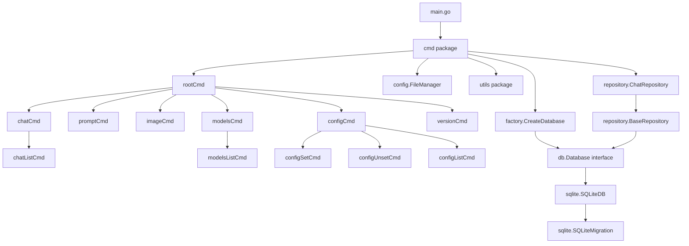

# Code Structure

## Build System

- **Type**: Go Modules (`go build`), orchestrated by a `Makefile`; releases built with GoReleaser.
- **Configuration**:
  - `go.mod` / `go.sum` — module `github.com/chat-cli/chat-cli`, Go 1.23.4.
  - `Makefile` — targets: `cli` (build to `./bin/chat-cli`), `test`, `test-coverage`, `test-short`, `benchmark`, `clean-test`, `lint` (`go vet` + `go fmt`), `clean`.
  - `.golangci.yml` — richer lint ruleset (gofmt, goimports, govet, errcheck, staticcheck, unused, gosimple, ineffassign, gosec, misspell, unparam, nakedret, prealloc, copyloopvar, gocritic) used in CI, beyond the plain `make lint`.
  - `.goreleaser.yaml` — multi-OS/arch binary + Homebrew tap release automation.
  - `.readthedocs.yaml` + `docs/` — Sphinx-based documentation site.

## Key Classes/Modules



### Text Alternative
```
main.go -> cmd package
  cmd: rootCmd -> chatCmd -> chatListCmd
              -> promptCmd
              -> imageCmd
              -> modelsCmd -> modelsListCmd
              -> configCmd -> configSetCmd, configUnsetCmd, configListCmd
              -> versionCmd
  cmd depends on: config.FileManager, factory.CreateDatabase, utils package,
                  repository.ChatRepository
  factory.CreateDatabase -> db.Database interface -> sqlite.SQLiteDB -> sqlite.SQLiteMigration
  repository.ChatRepository -> repository.BaseRepository -> db.Database interface
```

### Existing Files Inventory

- `main.go` - Entry point; calls `cmd.Execute()`.
- `integration_test.go` - Build-tagged (`integration`) end-to-end CLI tests against the compiled binary.
- `cmd/root.go` - Base Cobra command; when run without subcommands, delegates straight to `chatCmd.Run`. Defines all shared persistent flags (`--region`, `--model-id`, `--custom-arn`, `--chat-id`, `--temperature`, `--topP`, `--max-tokens`).
- `cmd/chat.go` - Interactive chat command: loads config, opens DB, validates/resolves model, replays prior messages if `--chat-id` set, runs the streaming input/output loop, persists every turn.
- `cmd/chatList.go` - `chat list` subcommand: prints the 10 most recent chat sessions as a table.
- `cmd/prompt.go` - `prompt` command: one-shot prompt with optional stdin document, optional image attachment, streaming or `--no-stream` full response.
- `cmd/image.go` - `image` command: generates an image via Stability AI or Amazon Titan image models and writes it to disk.
- `cmd/models.go` - `models` parent command (placeholder `Run` that just prints "models called").
- `cmd/modelsList.go` - `models list` subcommand: lists all foundation models available in the region via Bedrock control-plane API.
- `cmd/config.go` - `config` command group: `set`, `unset`, `list` for persisted `model-id`/`custom-arn` values, backed by Viper + direct YAML file edits.
- `cmd/version.go` - `version` command: prints a hardcoded version string + OS/arch.
- `cmd/cmd_test.go` - Unit tests for the `cmd` package (see code-quality-assessment.md for coverage).
- `config/config.go` - `FileManager`: resolves OS-specific config/data directories, initializes Viper, implements config value precedence (`GetConfigValue`).
- `config/config_test.go` - Unit tests for `FileManager`.
- `db/db.go` - `Database` interface + shared `Config` struct.
- `db/migrations.go` - `Migration` interface (`MigrateUp`/`MigrateDown`).
- `db/sqlite/sqlite.go` - `SQLiteDB`: implements `db.Database` using `modernc.org/sqlite` (pure-Go, no CGO).
- `db/sqlite/migrations.go` - `SQLiteMigration`: creates the `chats` table + `updated_at` trigger.
- `factory/database.go` - `CreateDatabase`: driver-selection factory (only `sqlite` currently implemented; `postgres` stubbed as a comment).
- `repository/base.go` - Generic `Repository[T]` interface + `BaseRepository` struct (holds a `db.Database`).
- `repository/chat.go` - `Chat` model + `ChatRepository` (`Create`, `List`, `GetMessages`).
- `repository/chat_test.go` - Unit tests for `ChatRepository`.
- `utils/utils.go` - `ProcessStreamingOutput`, `ReadImage`, `DecodeImage`, `StringPrompt`, `LoadDocument`.
- `utils/utils_test.go` - Unit tests for the above.
- `utils/bubbleinput.go` - `InputField` BubbleTea model + `BubbleInput()` — the interactive terminal text box used by the chat loop.
- `utils/bubbleinput_test.go` - Unit tests for the input widget.

## Design Patterns

### Repository Pattern
- **Location**: `repository/base.go`, `repository/chat.go`
- **Purpose**: Decouple command code from SQL/storage details; generic `Repository[T]` interface intended to be reused for future entity types beyond `Chat`.
- **Implementation**: `ChatRepository` embeds `BaseRepository` (which holds a `db.Database`); only `Chat`-specific methods (`Create`, `List`, `GetMessages`) are implemented — `GetByID`, `Update`, `Delete` from the generic interface are not yet implemented for `Chat`.

### Factory Pattern
- **Location**: `factory/database.go`
- **Purpose**: Let calling code obtain a working `db.Database` without knowing which concrete driver is configured.
- **Implementation**: `CreateDatabase(config)` switches on `config.Driver`; currently only handles `"sqlite"`, connects it, and returns the interface. A `"postgres"` case is commented out as a placeholder for future multi-database support.

### Interface Segregation / Dependency Inversion
- **Location**: `db/db.go` (`Database` interface), `db/migrations.go` (`Migration` interface)
- **Purpose**: Keep `cmd` and `repository` packages storage-agnostic so a new backend can be added by implementing the interfaces, without touching calling code.
- **Implementation**: `sqlite.SQLiteDB` and `sqlite.SQLiteMigration` implement these interfaces; nothing outside `db/sqlite` references `modernc.org/sqlite` directly.

### Command Pattern (via Cobra)
- **Location**: All of `cmd/`
- **Purpose**: Each CLI command/subcommand is a self-contained `*cobra.Command` with its own `init()` registering flags and wiring into its parent — a standard, idiomatic Cobra layout.
- **Implementation**: `root.go` special-cases the no-subcommand invocation to fall through to `chatCmd.Run`, so `chat-cli` alone behaves like `chat-cli chat` (but chat flags are duplicated onto `rootCmd` so they work at the top level too).

## Critical Dependencies

### github.com/spf13/cobra (v1.8.1)
- **Usage**: All CLI command/flag definitions across `cmd/`.
- **Purpose**: Standard Go CLI framework providing subcommands, flag parsing, help text generation.

### github.com/spf13/viper (v1.19.0)
- **Usage**: `config/config.go` — backs `FileManager`'s persisted YAML config.
- **Purpose**: Config file read/write with defaults and precedence support.

### github.com/aws/aws-sdk-go-v2 (+ bedrock, bedrockruntime, config) (v1.32.6 / v1.25.0 / v1.23.0 / v1.28.6)
- **Usage**: Every command that talks to Bedrock (`chat`, `prompt`, `image`, `models list`).
- **Purpose**: AWS credential resolution, Bedrock control-plane (model listing/details) and runtime (Converse/ConverseStream/InvokeModel) calls.

### modernc.org/sqlite (v1.38.2)
- **Usage**: `db/sqlite/sqlite.go`.
- **Purpose**: Pure-Go (CGO-free) SQLite driver for `database/sql` — chosen specifically to avoid CGO cross-compilation issues (see commit history: "Switch to pure Go SQLite driver ... Fix SQLite CGO compilation error").

### github.com/charmbracelet/bubbletea, bubbles, lipgloss (v1.3.6 / v0.21.0 / v1.1.0)
- **Usage**: `utils/bubbleinput.go`.
- **Purpose**: TUI framework powering the interactive multi-line input box used in the chat loop.

### github.com/satori/go.uuid (v1.2.0)
- **Usage**: `cmd/chat.go` — generates a new chat session UUID when `--chat-id` isn't supplied.
- **Purpose**: Chat session identification.

### github.com/go-micah/go-bedrock (v0.2.0)
- **Usage**: `cmd/image.go` — `providers.StabilityAIStableDiffusionInvokeModelInput/Output`, `providers.AmazonTitanImageInvokeModelInput/Output`.
- **Purpose**: Typed request/response bodies for image-generation model providers (Bedrock's `InvokeModel` takes raw JSON, so this package supplies the provider-specific schemas).
