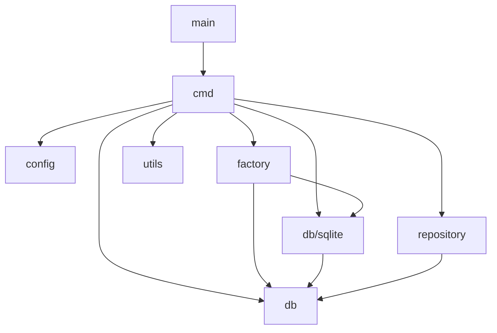

# Dependencies

## Internal Dependencies



### Text Alternative
```
main -> cmd
cmd -> config, db, db/sqlite, factory, repository, utils
factory -> db, db/sqlite
db/sqlite -> db
repository -> db
```

### `cmd` depends on `config`
- **Type**: Compile
- **Reason**: Every command that touches persisted settings (`chat`, `chat list`, `prompt`, `config`) needs `FileManager` for OS paths, Viper init, and config precedence.

### `cmd` depends on `db`, `db/sqlite`, `factory`
- **Type**: Compile
- **Reason**: `chat` and `chat list` need a live database connection; `factory.CreateDatabase` returns a `db.Database` backed transparently by `db/sqlite`.

### `cmd` depends on `repository`
- **Type**: Compile
- **Reason**: `chat` and `chat list` use `ChatRepository` to read/write conversation history instead of writing raw SQL inline.

### `cmd` depends on `utils`
- **Type**: Compile
- **Reason**: `chat`, `prompt`, `image` all need streaming output processing and/or image IO and/or the interactive input widget.

### `factory` depends on `db`, `db/sqlite`
- **Type**: Compile
- **Reason**: Implements the driver-selection switch that returns a `db.Database`; today only wires up the `db/sqlite` implementation.

### `db/sqlite` depends on `db`
- **Type**: Compile
- **Reason**: `SQLiteDB`/`SQLiteMigration` implement the `db.Database`/`db.Migration` interfaces.

### `repository` depends on `db`
- **Type**: Compile
- **Reason**: `BaseRepository` holds a `db.Database` so repositories can execute queries without knowing the concrete driver.

## External Dependencies

### github.com/aws/aws-sdk-go-v2 (v1.32.6) + submodules
- **Version**: `config` v1.28.6, `service/bedrock` v1.25.0, `service/bedrockruntime` v1.23.0
- **Purpose**: AWS credential/config resolution and Bedrock control-plane/runtime API clients — the core external integration of the whole product.
- **License**: Apache-2.0

### github.com/spf13/cobra (v1.8.1)
- **Purpose**: CLI command/flag framework underpinning all of `cmd/`.
- **License**: Apache-2.0

### github.com/spf13/viper (v1.19.0)
- **Purpose**: Configuration file management.
- **License**: MIT

### github.com/charmbracelet/bubbletea (v1.3.6), bubbles (v0.21.0), lipgloss (v1.1.0)
- **Purpose**: TUI framework and components for the interactive chat input box.
- **License**: MIT

### modernc.org/sqlite (v1.38.2)
- **Purpose**: Pure-Go SQLite driver, avoids CGO to keep cross-compilation simple for GoReleaser (replaced a CGO-based driver per commit `148fefb`/`561ecf2`).
- **License**: BSD-3-Clause (plus bundled SQLite public-domain source)

### github.com/satori/go.uuid (v1.2.0)
- **Purpose**: Chat session UUID generation.
- **License**: MIT
- **Note**: This library is effectively unmaintained (archived) — a known ecosystem concern worth revisiting (see code-quality-assessment.md).

### github.com/mattn/go-isatty (v0.0.20)
- **Purpose**: TTY detection to switch between interactive (BubbleInput) and piped (stdin buffer) input modes.
- **License**: MIT

### github.com/go-micah/go-bedrock (v0.2.0)
- **Purpose**: Provider-specific request/response types for Bedrock image models (Stability AI, Amazon Titan).
- **License**: MIT (author-maintained companion library, smaller ecosystem footprint than the AWS SDK)

### golang.org/x/term (v0.33.0)
- **Purpose**: Terminal size detection for the input widget.
- **License**: BSD-3-Clause

### gopkg.in/yaml.v3 (v3.0.1)
- **Purpose**: Manual YAML marshal/unmarshal for `config unset` (removing a single key without Viper support for that operation).
- **License**: MIT/Apache-2.0 dual

### Transitive dependencies (~35 indirect modules)
- **Purpose**: Pulled in by Cobra/Viper (`fsnotify`, `afero`, `pelletier/go-toml`, `hashicorp/hcl`, `magiconair/properties`, `subosito/gotenv`, `sagikazarmark/locafero`, etc.), AWS SDK (`smithy-go`, credential/endpoint internals), Bubble Tea ecosystem (`muesli/*`, `charmbracelet/x/*`, `erikgeiser/coninput`, `lucasb-eyer/go-colorful`, `atotto/clipboard`), and `modernc.org/sqlite` (`modernc.org/libc`, `mathutil`, `memory`, `ncruces/go-strftime`, `remyoudompheng/bigfft`).
- **Purpose**: Standard, low-risk supporting libraries for the frameworks above — no direct application code references them.
