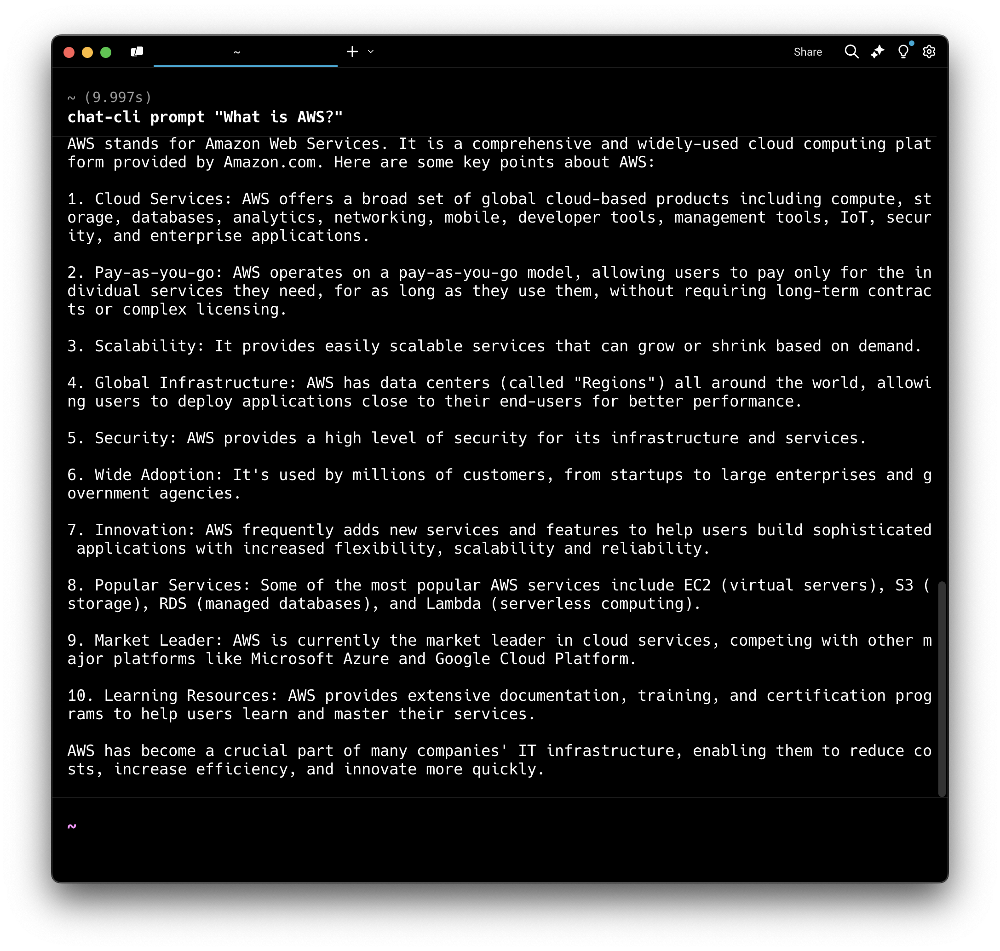

# Chat-CLI

Chat-CLI is a little terminal based program that lets you interact with [LLM](#models)s available via [Amazon Bedrock](https://aws.amazon.com/bedrock).



## Quick start

Using [Homebrew](https://brew.sh/) do this:

```shell
    brew tap chat-cli/chat-cli
    brew install chat-cli
```

If you have an [AWS account](#prereqs), and you have [enabled model access](#prereqs) for the LLMs you wish to use, you can do the following:

Using the [prompt](#prompt) command, you can send one liner prompts with attachments to any text to text LLM like Anthropic's Claude Sonnet 3.5, Meta's Llama 3.2, or Amazon Nova Pro

```shell
   # set up your AWS credentials on your machine using the AWS CLI
   aws configure

   # send a prompt to Anthropic Claude Sonnet 3.5
   chat-cli prompt "What is AWS?"

   # read contents of a file to Chat-CLI via stdin
   cat your-file.go | chat-cli prompt "explain this code"

   # attach an image for models that support vision like Anthropic Claude Sonnet 3.5
   chat-cli prompt "describe this image" --image myfile.png
```

With the [chat](#chat) command, you can start an interactive chat session with any text to text LLM

```shell
   # start an interactive chat session using Amazon Nova Micro
   chat-cli chat
```

With the [image](#image) command, you can generate images with any text to image LLM like Amazon Nova Canvas or Stability AI's Stable Diffusion 3

```shell
   # generate an image from text using Amazon Nova Canvas
   chat-cli image "generate an image of a cat driving a car"
```

## Contents

```{toctree}
---
maxdepth: 3
---
setup
usage
models
marketplace
```